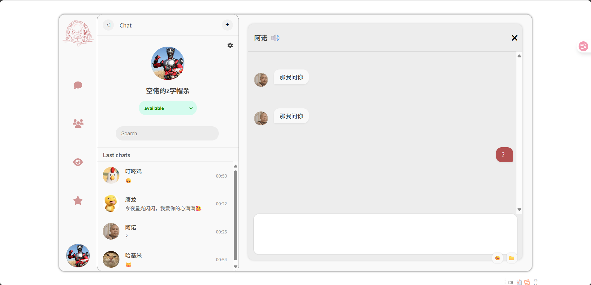
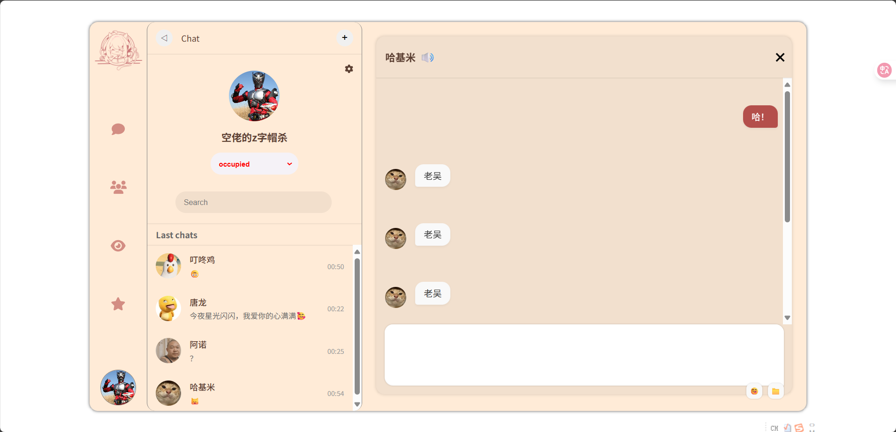
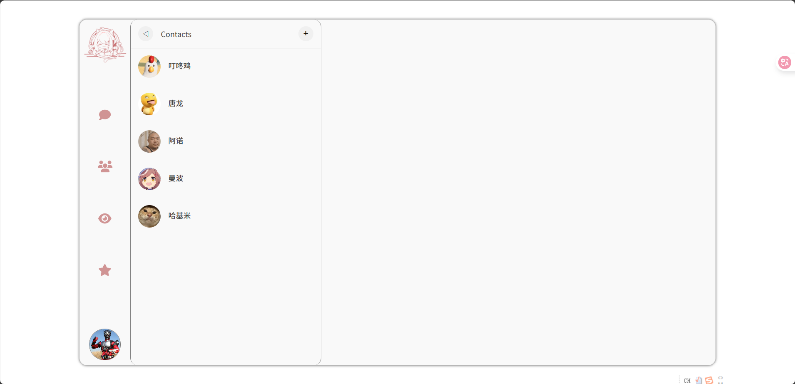
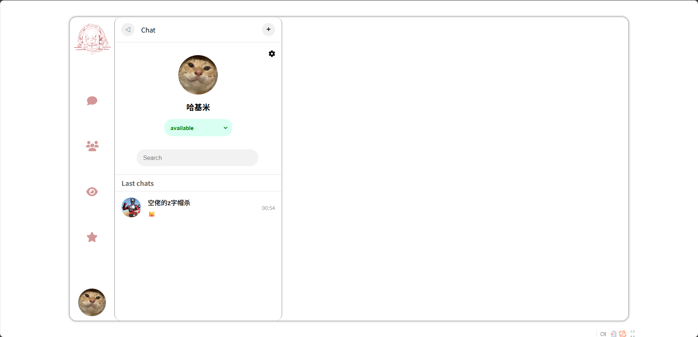
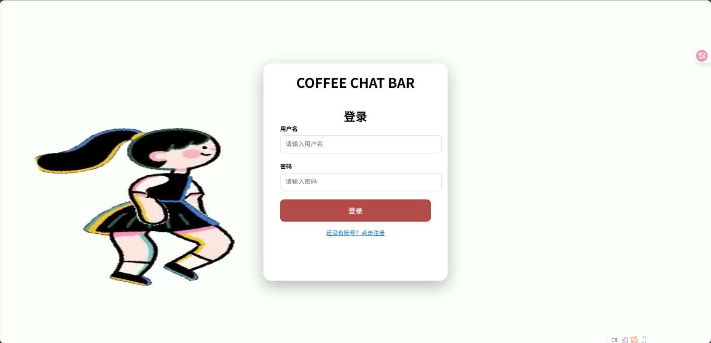
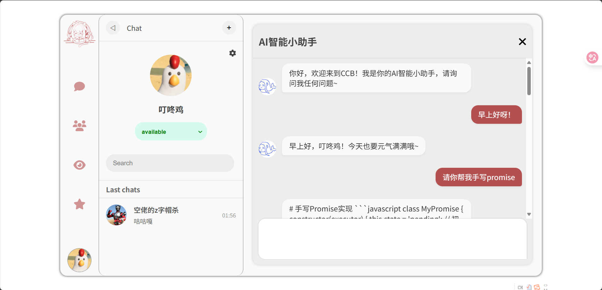
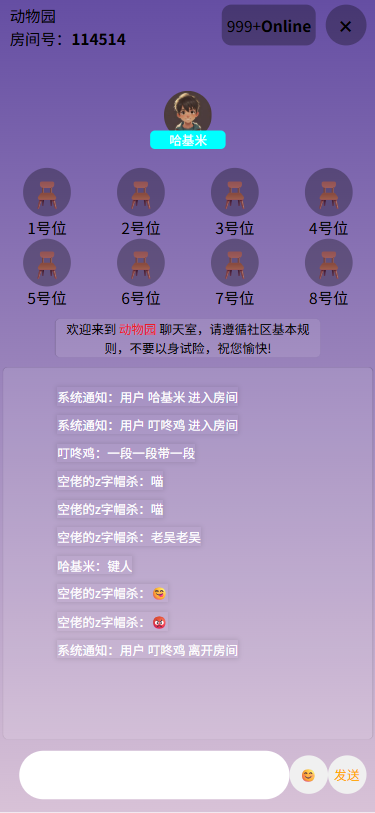

# CCB (Coffee Chat Bar) 聊天软件

~写在前边：鉴于本人拙劣的模仿能力，所以本次这个项目是个原创的聊天室项目（但是不排除借鉴了互联网上各位大佬的奇思妙想），但是因为是我这个半桶水完成出来的东西，所以各种莫名其妙的虫子满天飞是很正常的事情，但是能跑就行（）~

---

## 技术栈

* **前端** ：Vue 3 + Vue Router + Pinia + Vite
* **后端** ：Express + MongoDB + Socket.IO
* **桌面打包** ：Electron

---

## 快速启动项目

### 后端启动（建议先把服务器给开了）

```
cd server
npm install
nodemon server.js
```

### 前端启动

```
cd ccb
npm install
npm run dev
```

### 客户端启动

```
cd ccb
npm run start
```

### 桌面端安装

```
cd ccb
npm run dist
```

(然后可以看到桌面多了一个COFFEE CHAT BAR文件夹,安装其中的exe文件即可，会自动创建快捷方式)

---

## 数据库与环境配置

请先安装并启动 MongoDB，并在项目的 `.env` 文件中配置以下环境变量：

### 后端 `.env` 示例

```
PORT=3000
MONGO_URL=mongodb://localhost:27017/ccb
```

### 前端 `.env` 示例

```
VITE_API_URL=http://localhost:3000
```

⚠ 注意：前端和后端都有各自的 `.env` 文件，启动前请正确配置。

---

## 项目亮点

* 聊天室功能（支持一对一私聊、多人在线聊天室）
* 登录注册系统（JWT 身份验证）
* 动态背景（基于 Canvas 实现动效）
* 前后端分离架构，支持热更新开发体验
* Electron 桌面端打包支持

---

## 已知问题 & 后续规划

### 已完成但待优化

* 文件传输功能：目前仅实现了前端文件上传，尝试过通过 Socket.IO 传输文件，因架构调整量大暂未完成，未来考虑数据库重构后加入完整支持。
* 匿名聊天室模式：最初设想用户进入前生成临时昵称，数据库中已留有 `nickname` 字段，后续功能未完全开发，目前暂以注册用户为主。
* 在线聊天室头像分配：本计划为每位参会者按顺序分配 Emoji 图标，当前索引逻辑存在小 bug，后续修复。

### 未来计划

* 在 LastChats 页面增加右键菜单支持，提供“一键清空聊天记录”功能。
* 新增用户更换头像功能
* 将用户状态（status）转变为动态效果
* 增加朋友圈（moments）功能

---

## 碎碎念

本项目作为阶段性学习总结产物，完成度不算高但功能已基本可用。由于个人时间和精力有限，部分功能未能如期实现。感谢一路走来的各种踩坑、学习、踩坑与踩坑。

---

## License

This project is licensed under the [MIT License](./LICENSE).

---

## 项目截图

### 主页 1



### 主页 2



### 通讯录



### 主页 3



### 登录页



### AI助手



### 聊天室



## 最后一句

**能跑，就是胜利！（当然也有可能是人跑了）**
